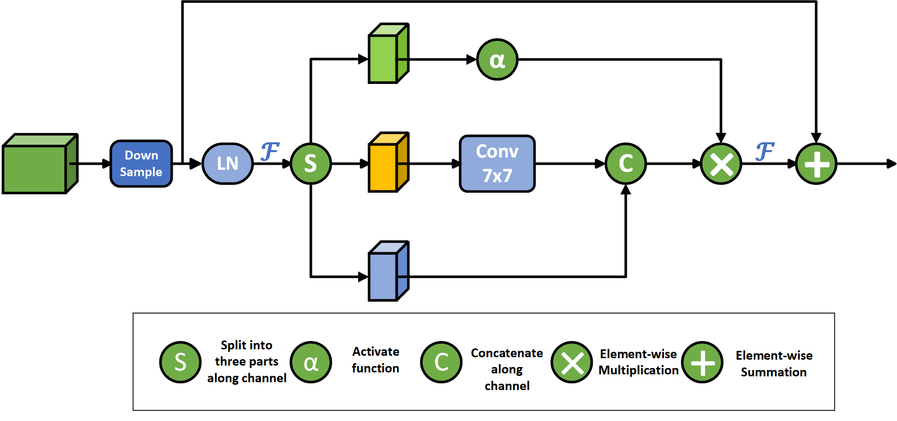
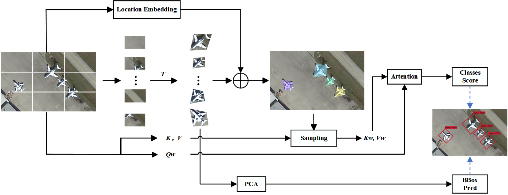

# Deformable-Quadrilateral-Attention
This study introduces a novel approach for oriented object detection, integrating a learnable Deformable Quadrilateral Attention (DQA) mechanism tailored for this task. The DQA mechanism extends window-based attention to accommodate general quadrilateral formulations, enhancing feature representation and contextual information capture.
### 模型与机制示意图  

  

  
